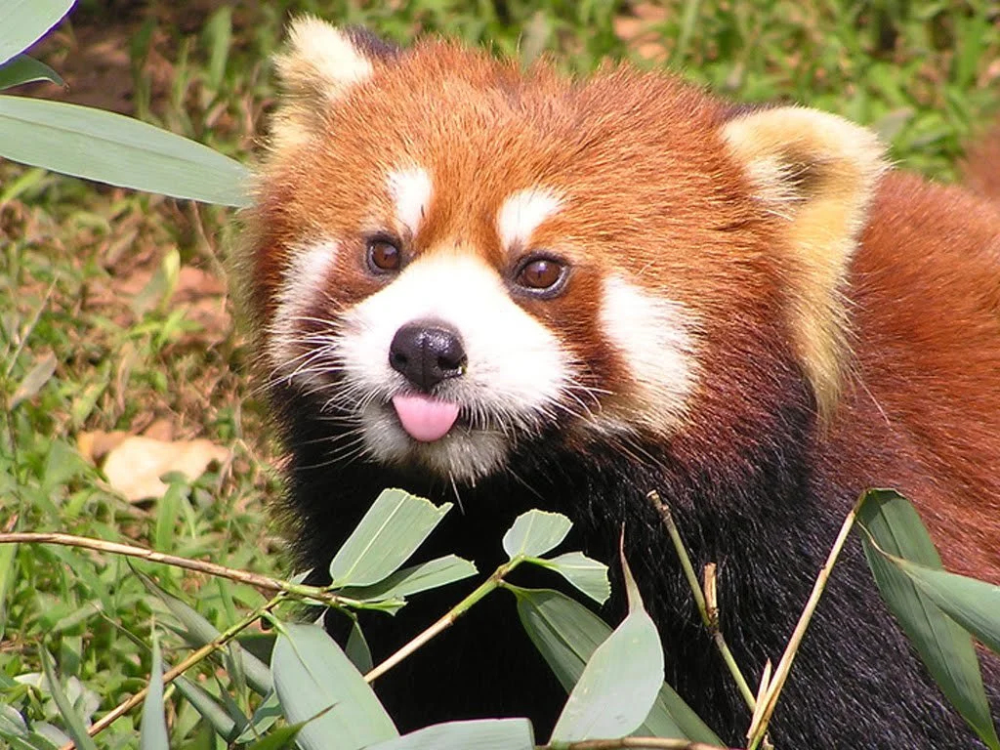

# R(ed)Panda

## Using ML algorithms as an excuse to have a funny animal-themed repo

  
  <figcaption align="center"> {{This is a **red panda**. Image from the web.}}</figcaption>

The intent in creating this repo is to **implement standard ML algorithms from scratch** and eventually **create tutorials** around it: the goal is purely **educational** (and use a funny animal as a theme for a repo!).